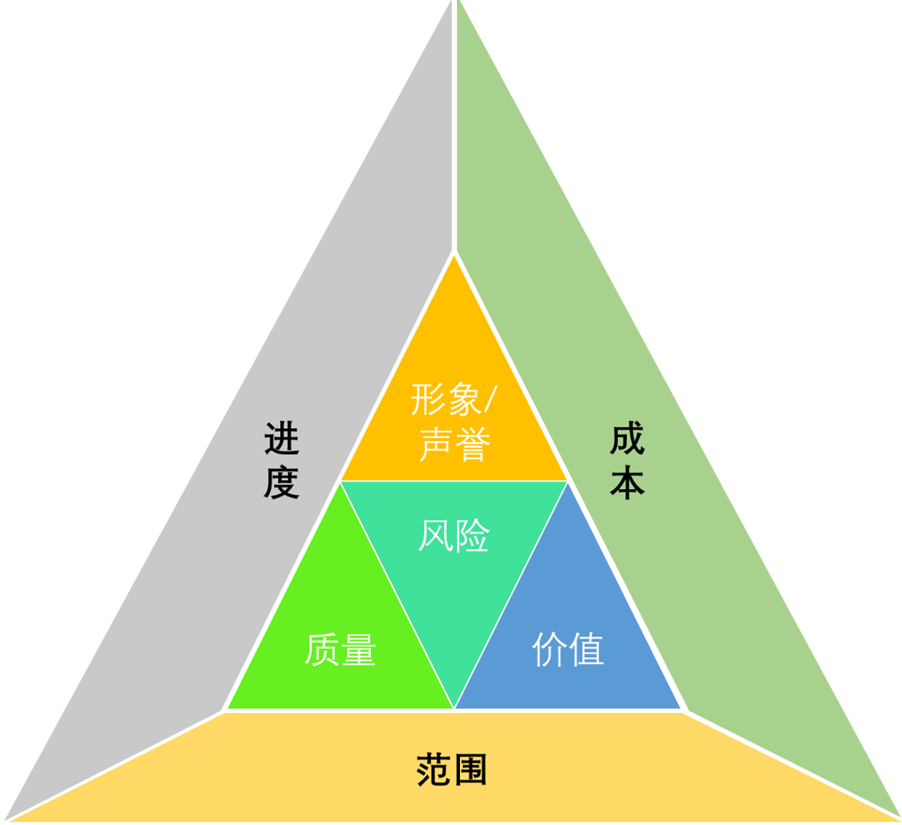
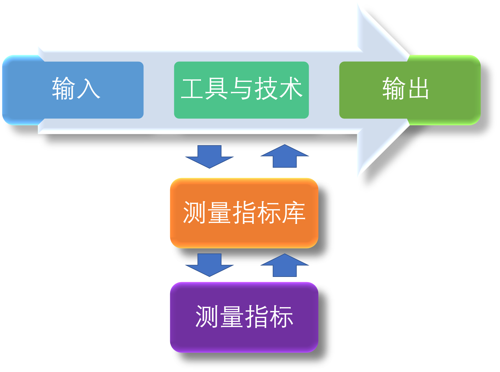

# 失敗項目分析與挽救

## CH01 理解成敗

### 案例故事

**第一個案例故事**

> 你花30萬元買了一台轎車，這塊車雖然還不錯。但是幾天后，車載音響系統出現了一個問題，導致聲音特別小。
>
> *請問購買汽車的項目是否成功*
>
> 

**第二個案例故事**

> 如果你的公司實施了1000萬美元的IT項目。
>
> 但是由於軟件缺陷，導致了5000萬元的訂單失效。
>
> 這時候，*這個項目是成功還是失敗？*
>
> 如果軟件缺陷已經被修復，*那麽這個項目是實施還是失敗？*

**結論：項目成功的複雜性!**

### 對項目成功的歷史觀點

> 掙值管理的歷史
>
> 美國國防部（Department of Defense, DOD) 對於數以萬計的軍事采購合同來説，如果沒有一套標準化的項目績效匯報標準化形式來説，無疑是災難性的。DOD出於這個目的，創建了掙值管理系統（Earned Value Measurement System，EVMS）

**倒置规则**：应该避免或绝不测量具有最高信息价值（尤其是对做决策和测量成功而言）的测量指标。（因为数据收集困难，而时间和成本这些基本的指标测量容易）

掙值管理中，大量的計算都和時間和成本有關。但是實際上，項目執行過程中的關鍵因素：範圍、時間、成本在很多項目中并不同等重要。只要客戶允許任何的超支或者延期，那麽項目執行人員天然的就會以產品性能等因素來測量。

所以，項目成功的標準越來越傾向於“相關方滿意”這個概念。

### 主要制約因素和次要制約因素

*田辛老師注釋：主要制約因素往往是站在項目經理的角度上的所謂“主要”因素。但是站在更高的商業邏輯上，次要制約因素有時候更加重要*

主要制約因素：

* 項目的範圍
* 項目的進度
* 項目的成本

次要制約因素：

* 項目完成後使用客戶的名字作爲項目證明人（項目可以作爲他們的經典案例證明其組織在某方面的能力）
* 獲得後續工作的可能性
* 財務成功（利潤最大化/股東權益最大化）
* 成就技術優勢（競爭優勢）
* 美學價值（Aesthetic Value）和易用性
* 與戰略規劃目標相一致
* 監管機構的要求
* 遵守衛生安全法律
* 符合環境保護要求
* 增强公司的聲譽和形象
* 滿足員工的個人需要（進步機會）
* 支持和捍衛道德行爲（如薩班斯-奧克斯利法案）

### 结合主要制约因素和次要制约因素的企业管理方法论EPM

**情景**

> 一名新委托人授予了一家賣方一份合同。賣方之所以贏得此合同，是因爲他們價格低報了大約40%。儅問他們爲什麽出低價時，賣方說，他們關於這個項目的成功定義是儅投標其他委托人的合同時，此項目可以作爲他們的經典案例證明其組織在某方面的能力。虧本完成合同與證明其組織能力并非同等重要
>
> > **經驗教訓** 在項目開始時，清晰定義項目成功（和失敗）至關重要。

> 迪士尼的六重制約因素
>
> * 進度
> * 成本
> * 範圍
> * 安全
> * 質量
> * 美學價值
>
> 在以上的六個因素中，安全被當成一個單獨的最重要的制約因素。然後是質量和美學。這三個是高優先級制約因素，不允許出現任何折中。

基於PMBOK最新的版本（嚴格意義上說從第四版開始）項目成功的因素變得更加的複雜。但是毋庸置疑的是，在實際項目管理中，任何的制約因素都遵循一個原則：只有測量才能衡量。所以，針對中所周知的“ITTO”的思路，如果將其進一步完善，即：

### 進一步理解項目成功

儘管決策中仍然測量和使用客戶滿意，但是大多數夥伴組織已經將其關注點從客戶滿意轉移到客戶價值。

進而，修改了項目的定義：

**PMBOK中**，項目是爲了創造獨特產品、服務或成果的臨時性工作；

**未來**，安排實現的一組可實現的商業價值；

項目成功的未來定義：

**在競爭的制約因素内達成渴望的商業價值**

| 關鍵相關方價值因素 | 成功制約因素 | 權重因素（%） |
| ------------------ | ------------ | ------------- |
| 質量               | 質量         | 20            |
| 交付日期           | 進度         | 30            |
| 易用性             | 績效         | 35            |
| 風險最小化         | 風險         | 15            |

**一旦確定了相關方的價值因素，則根據確定的價值因素，篩選制約因素，定義項目成功**

**案例**

> 銥星系統項目——既是成功的項目，又是失敗的項目
>
> ------
>
> 銥星系統項目被設計來創建一個全世界的無綫手持移動電話系統，保證在任何時候能和世界的任何地方通信。摩托羅拉和銥星有限責任公司（LLP）的高管們都將這個項目認爲是世界第九大奇跡。但是經過十多年的努力，以及幾十億美元投資之後，銥星項目解決的是一個屈指可數用戶才需要解決的問題。
>
> * 這個項目成功：經過11年的努力，這個項目進度僅僅延遲了1個月的時間，創建了1,000多項技術專利；
> * 這個項目失敗：投資者損失了40多億美元，這個產品的市場在項目生命周期内就已經天翻地覆了。
>
> **最終，這個項目的成功僅僅是按照計劃和進度衡量了**